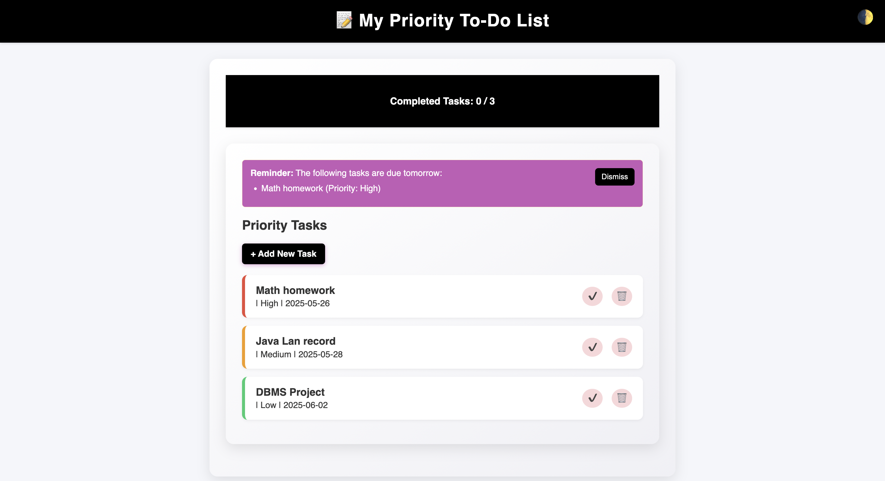
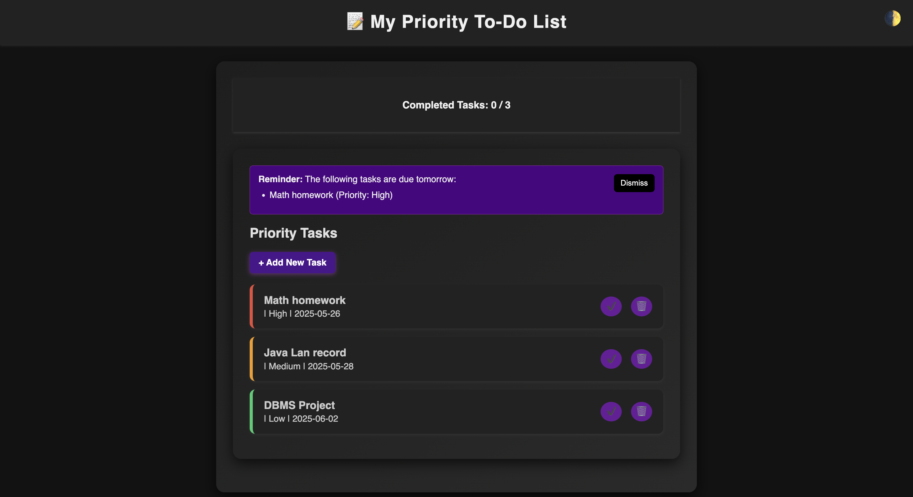

# ✅ Priority-Based To-Do List Web App

A simple Flask-based to-do list application that allows users to create, prioritize, and manage tasks with a clean UI. Includes support for marking tasks as complete/incomplete, dark/light mode toggle, reminder banners, and rewards for task completion!

---

## ✨ Features

- Add, view, and delete tasks
- Assign **priority levels** (High, Medium, Low)
- Set **due dates**
- Mark tasks as **completed** or **incomplete**
- Dynamic reward message when tasks are completed
- Dismissible **reminder banner** for tasks due tomorrow
- Confirmation dialogs for **delete** and **complete/incomplete** actions
- **Dark mode/light mode toggle** with local preference storage
- Clean and responsive interface with modern **CSS styling**
- Priority-based **color-coded borders** on task cards

---

## 💻 Tech Stack

- Python (Flask)
- HTML, CSS, and JavaScript
- MySQL (via SQLAlchemy or raw queries)
- Jinja2 Templates

---

## 🚀 Getting Started

1. **Clone the repo:**
   ```bash
   git clone https://github.com/your-username/priority-todo-app.git
   cd priority-todo-app
   ```

2. **Set up a virtual environment:**
   ```bash
   python3 -m venv venv
   source venv/bin/activate
   ```

3. **Install dependencies:**
   ```bash
   pip install -r requirements.txt
   ```

4. **Create the database and table:**

   In your MySQL CLI or GUI (like phpMyAdmin), run:

   ```sql
   CREATE DATABASE your_database_name;
   USE your_database_name;

   CREATE TABLE task (
       id INT AUTO_INCREMENT PRIMARY KEY,
       title VARCHAR(255) NOT NULL,
       description TEXT,
       due_date DATE,
       priority ENUM('High', 'Medium', 'Low'),
       completed BOOLEAN DEFAULT FALSE,
       created_at DATETIME DEFAULT CURRENT_TIMESTAMP
   );
   ```

5. **Configure the database:**

   Update `config.py` with your MySQL credentials:

   ```python
   MYSQL_USER = 'your_username'
   MYSQL_PASSWORD = 'your_password'
   MYSQL_HOST = 'localhost'
   MYSQL_DB = 'your_database_name'
   ```

6. **Run the app:**
   ```bash
   python app.py
   ```

7. **Access the app:**

   Open [http://localhost:5000](http://localhost:5000) in your browser.

---

## 🌗 Dark Mode Toggle

Click the **moon icon** in the corner to toggle between light and dark mode. 

---

## 📸 Screenshots

Light Mode             |  Dark Mode
:-------------------------:|:-------------------------:
 | 

